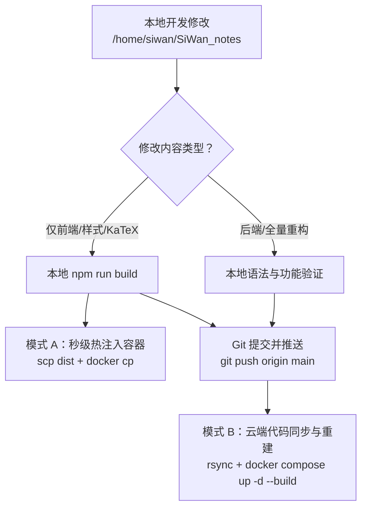

# 🚀 云服务器（ECS）全流程配置与部署实战指南

> 本指南基于 Ubuntu 22.04 LTS 系统实战总结，涵盖从**新服务器选购、网络安全组配置、SSH 连接与避坑、系统基础优化、宝塔/Docker 部署到项目发布**的完整标准化流程。下次购买新服务器时，照此操作即可快速完成部署。

---

## 目录
- [一、 云服务器选购与初始设置](#一-云服务器选购与初始设置)
- [二、 网络与安全组配置（核心避坑）](#二-网络与安全组配置核心避坑)
- [三、 首次 SSH 连接与网络代理技巧](#三-首次-ssh-连接与网络代理技巧)
- [四、 系统初始化与性能加固（防止内存溢出）](#四-系统初始化与性能加固防止内存溢出)
- [五、 安装宝塔运维面板（可视化管理）](#五-安装宝塔运维面板可视化管理)
- [六、 Docker 环境与常用容器化服务部署](#六-docker-环境与常用容器化服务部署)
  - [1. 安装 Docker 与 Compose](#1-安装-docker-与-compose)
  - [2. siwannote 笔记系统 Docker 运行架构与全流程实战](#2-siwannote-笔记系统-docker-运行架构与全流程实战)
  - [3. 部署 MySQL 数据库容器](#3-部署-mysql-数据库容器)
- [七、 Web 静态站点与个人作品集部署](#七-web-静态站点与个人作品集部署)
- [八、 日常运维命令速查表](#八-日常运维命令速查表)
- [九、 GitHub 仓库维护与代码推送更新全流程（实战 SOP）](#九-github-仓库维护与代码推送更新全流程实战-sop)
- [十、 AI 协同开发与代码修改指导手册（开箱即用 Prompt）](#十-ai-协同开发与代码修改指导手册开箱即用-prompt)

---

## 一、 云服务器选购与初始设置

### 1. 实例规格推荐
* **操作系统**：推荐选择 **Ubuntu 22.04 LTS (64位)**（软件源新、Docker 兼容性好、社区资源丰富）。
* **配置推荐**：个人建站/学习推荐 **2核 2G** 或 **2核 4G**（低于 2G 内存跑 MySQL + Nginx + 多个应用容易出现 OOM 崩溃）。
* **系统盘**：推荐 **40GB ~ 60GB ESSD**。

### 2. 初始登录凭证
* 购买时设置 **自定义密码**（建议包含大小写字母、数字和特殊字符，如 `YourPass123@`），或创建并绑定 SSH 密钥对（`.pem`）。

---

## 二、 网络与安全组配置（核心避坑）

云服务器无法连接，**90% 的原因在于云平台的安全组（Security Group）未放行端口**。

### 必开安全组入方向规则（阿里云控制台配置）：

进入 **阿里云 ECS 控制台 -> 实例 -> 安全组 -> 入方向规则 -> 添加规则**：

| 优先级 | 协议类型 | 端口范围 | 授权对象 | 用途说明 |
| :---: | :---: | :---: | :---: | :--- |
| **1** | TCP | `22/22` | `0.0.0.0/0` | SSH 远程终端连接 |
| **1** | TCP | `80/80` | `0.0.0.0/0` | HTTP 网页访问（Nginx） |
| **1** | TCP | `443/443` | `0.0.0.0/0` | HTTPS 加密网页访问 |
| **1** | TCP | `8888/8888` | `0.0.0.0/0` | 宝塔运维面板后台端口 |
| **1** | TCP | `8080/8080` | `0.0.0.0/0` | siwannote 笔记系统 / Web 应用 |
| **1** | TCP | `13306/13306` | `0.0.0.0/0` | MySQL 外部连接端口（建议改用自定义端口） |

> ⚠️ **注意**：
> 1. 如果绑定了多个安全组，请确保规则添加在当前实例生效的安全组上。
> 2. 生产环境中，数据库端口（如 13306）建议仅绑定本地内网或指定白名单 IP。

---

## 三、 首次 SSH 连接与网络代理技巧

### 1. 基础连接命令
```bash
ssh root@<你的服务器IP>
# 输入密码后回车即可登录
```

### 2. 本地网络连不上 22 端口时的解决方案（走代理通道）
如果本地开发机网络直连云服务器 22 端口提示 `Connection refused`，可以通过本地代理（如 Clash 监听在 `127.0.0.1:7890`）进行隧道连接：

在本地开发机执行：
```bash
# 配置 ~/.ssh/config 自动走本地 SOCKS5 代理
mkdir -p ~/.ssh
cat << 'EOF' >> ~/.ssh/config

Host my-server
    HostName <你的服务器IP>
    User root
    Port 22
    ProxyCommand nc -X 5 -x 127.0.0.1:7890 %h %p
    StrictHostKeyChecking no
    UserKnownHostsFile /dev/null
EOF

# 之后直接运行以下命令即可免输入参数连接：
ssh my-server
```

### 3. 本机当前已配置的服务器别名（直接可用）
当前开发机 `~/.ssh/config` 已配置如下别名，无需每次输入 IP 和密码：
```bash
# 登录云服务器
ssh aliyun-server

# 向服务器传输文件（示例）
scp local_file.tar.gz aliyun-server:/tmp/
```
* **服务器公网 IP**：`47.243.25.122`（阿里云香港）
* **SSH 端口**：`22`
* **默认用户**：`root`
* **代理通道**：走本地 SOCKS5 代理 `127.0.0.1:7890`

---

## 四、 系统初始化与性能加固（防止内存溢出）

登录服务器后，首先进行以下标准初始化操作：

### 1. 更新软件包源
```bash
sudo apt update && sudo apt upgrade -y
sudo apt install -y curl wget git vim net-tools htop ufw
```

### 2. 配置 2GB Swap 虚拟内存（针对 1G~2G 小内存服务器必做！）
> 当物理内存耗尽时，Swap 可以防止 MySQL 或 Docker 容器直接因 OOM 被内核杀死。

```bash
# 1. 创建 2GB 的 swap 文件
sudo fallocate -l 2G /swapfile
sudo chmod 600 /swapfile
sudo mkswap /swapfile
sudo swapon /swapfile

# 2. 设置开机自启
echo '/swapfile none swap sw 0 0' | sudo tee -a /etc/fstab

# 3. 优化交换积极性（推荐设为 10~20，优先使用物理内存）
sudo sysctl vm.swappiness=15
echo 'vm.swappiness=15' | sudo tee -a /etc/sysctl.conf

# 4. 查看 swap 状态
free -h
```

### 3. 配置本地防火墙（UFW）
```bash
sudo ufw allow 22/tcp
sudo ufw allow 80/tcp
sudo ufw allow 443/tcp
sudo ufw allow 8888/tcp
sudo ufw allow 8080/tcp
sudo ufw allow 13306/tcp
# 启用防火墙
sudo ufw enable
```

---

## 五、 安装宝塔运维面板（可视化管理）

宝塔面板提供可视化的文件管理、Nginx 站点管理、SSL 证书申请和资源监控。

### 1. 官方一键安装命令
```bash
wget -O install.sh https://download.bt.cn/install/install-ubuntu_6.0.sh && sudo bash install.sh ed8484bec
```

### 2. 获取登录入口与默认密码
安装完成后，终端会输出外网面板地址和账号密码。如果后续忘记，可随时执行：
```bash
bt default
```

### 3. 常用宝塔命令行工具
* `bt 1`：重启面板服务
* `bt 5`：修改管理员密码
* `bt 6`：修改管理员用户名
* `bt 14`：查看面板默认登录信息

---

## 六、 Docker 环境与常用容器化服务部署

### 1. 安装 Docker 与 Compose
```bash
# 官方一键安装脚本
curl -fsSL https://get.docker.com | bash -s docker

# 启动并设置开机自启
sudo systemctl enable --now docker

# 验证安装
docker --version
```

---

### 2. siwannote 笔记系统 Docker 运行架构与全流程实战

> **系统定位**：轻量级、无数据库依赖的现代 Markdown 知识库。所有文档以原生 `.md` 文本形式存储在磁盘物理目录 `/www/wwwroot/mymd`，内置多模型 AI 研习助手、对外开放权限隔离、全语法 LaTeX 数学公式渲染、实时全文检索与访客 IP 监控。

---

#### 🌟 云端实机当前 Docker 运行架构与配置

云端（`aliyun-server` / `47.243.25.122`）当前正在运行的生产容器参数如下：

* **宿主机代码路径**：`/root/SiWan_notes`
* **容器编排方式**：Docker Compose
* **容器名称**：`siwan_notes`
* **镜像名称**：`siwan_notes-siwan-notes:latest`
* **映射端口**：`8080:8080`（公网访问 `http://47.243.25.122:8080`）
* **存储挂载机制**：
  * `- ./data:/data`（挂载宿主机 `/root/SiWan_notes/data` 至容器内 `/data`）
  * `- /www:/www`（挂载宿主机 `/www` 目录，使容器可读写 `/www/wwwroot/mymd`）
  * `- /home:/home` 与 `- /root:/root`（全盘可读写挂载支持）
* **实际生效的文档路径**：容器内 `/app/.siwan_server_config.json` 设置了 `"storage_path": "/www/wwwroot/mymd"`，因此**网页端展示的所有 Markdown 笔记、附件、访客统计与权限配置全部落盘在宿主机 `/www/wwwroot/mymd`**。
* **默认管理员账号**：`admin` ｜ **初始密码**：`admin123`

`docker-compose.yml` 完整实机配置：
```yaml
services:
  siwan-notes:
    build: .
    container_name: siwan_notes
    restart: unless-stopped
    ports:
      - "8080:8080"
    environment:
      - PUID=0
      - PGID=0
      - SIWAN_AUTH_TYPE=none
      - SIWAN_PATH=/data
      - SIWAN_USERNAME=admin
      - SIWAN_PASSWORD=admin123
    volumes:
      - ./data:/data
      - /www:/www
      - /home:/home
      - /root:/root
```

---

#### 🌟 首次全新部署流程（首次购买新服务器或迁移系统）

##### 步骤 1：克隆开源代码库
```bash
git clone https://github.com/ShiSiWan/siwannote.git /root/SiWan_notes
cd /root/SiWan_notes
```

##### 步骤 2：创建宿主机持久化数据目录
```bash
mkdir -p /www/wwwroot/mymd/attachments
mkdir -p /root/SiWan_notes/data
```

##### 步骤 3：启动容器服务
```bash
cd /root/SiWan_notes
docker compose up -d --build
```

---

#### 🔄 日常运维与容器管理速查

* **查看容器运行状态与资源**：
  ```bash
  ssh aliyun-server "docker ps | grep siwan_notes"
  ssh aliyun-server "docker stats --no-stream siwan_notes"
  ```
* **查看容器实时日志**：
  ```bash
  ssh aliyun-server "docker logs -f --tail 50 siwan_notes"
  ```
* **平滑重启容器**：
  ```bash
  ssh aliyun-server "docker restart siwan_notes"
  ```
* **停止与启动容器**：
  ```bash
  ssh aliyun-server "cd /root/SiWan_notes && docker compose down"
  ssh aliyun-server "cd /root/SiWan_notes && docker compose up -d"
  ```
如果只更新了前端界面或数学渲染等静态资源：
```bash
# 本地编译完成后，直接将打包产物同步至云服务器容器内：
scp -r ./client/dist aliyun-server:/tmp/dist
ssh aliyun-server "docker cp /tmp/dist/. siwan_notes:/app/client/dist/ && rm -rf /tmp/dist"
```

---

#### 🔒 数据安全与灾备保障机制（核心避坑）

1. **零数据丢失原则**：
   * 所有笔记正文、图片/PDF 附件、AI 配置（`.siwan_ai_config.json`）、公开权限控制（`.siwan_permissions.json`）均直接保存在宿主机物理磁盘 `/www/wwwroot/mymd` 中。
   * 无论执行 `docker rm`、`docker compose down` 还是重构镜像，**物理数据绝不丢失**。
2. **一键快速备份与打包命令**：
   ```bash
   # 备份整个知识库为 zip 压缩包
   tar -czvf /root/siwan_notes_backup_$(date +%Y%m%d).tar.gz /www/wwwroot/mymd
   ```
3. **数据跨机器迁移**：
   在新服务器创建 `/www/wwwroot/mymd`，将上述备份解压进去，启动容器即可无缝恢复所有文档与设置。

---

#### 🌐 域名绑定与 Nginx 生产反向代理配置

为平台绑定专属域名（如 `md.siwan.dpdns.org`），并配置免费 SSL 证书及反向代理：

```nginx
server {
    listen 80;
    listen 443 ssl http2;
    server_name md.siwan.dpdns.org; # 替换为你绑定的域名

    # SSL 证书配置（可使用宝塔一键申请 Let's Encrypt 或手动指定）
    # ssl_certificate /path/to/fullchain.pem;
    # ssl_certificate_key /path/to/privkey.pem;

    # 支持大体积 PDF/图片等附件上传
    client_max_body_size 100M;

    location / {
        proxy_pass http://127.0.0.1:8080;
        proxy_set_header Host $host;
        proxy_set_header X-Real-IP $remote_addr;
        proxy_set_header X-Forwarded-For $proxy_add_x_forwarded_for;
        proxy_set_header X-Forwarded-Proto $scheme;

        # WebSocket 支持（保证 AI 流式输出与实时连接）
        proxy_http_version 1.1;
        proxy_set_header Upgrade $http_upgrade;
        proxy_set_header Connection "upgrade";

        # 缓冲优化
        proxy_buffering off;
        proxy_read_timeout 300s;
    }
}
```

---

#### 🛠️ 常见运维与排错技巧

* **重置或重建搜索索引**：
  登录管理员账号 -> 点击右上角「系统设置」 -> 点击「一键同步并重建索引」，Whoosh 引擎会自动在 1 秒内完成全盘重新编目。
* **查看容器实时资源**：
  `docker stats siwan_notes`（通常内存占用仅在 60MB~100MB 之间，极度轻量）。
* **修改管理员密码忘记了**：
  直接查看或编辑宿主机文件 `/www/wwwroot/mymd/.siwan_permissions.json` 中的 `admin_password` 字段即可重设。

---

### 3. 部署 MySQL 数据库容器

> 容器化部署 MySQL 便于随时备份、迁移和环境重置。

```bash
# 1. 创建数据库数据持久化目录
mkdir -p /data/mysql/data

# 2. 启动 MySQL 容器（以自定义端口 13306 暴露，防止 3306 爆破扫描）
docker run -d \
  --name mysql-server \
  --restart unless-stopped \
  -p 13306:3306 \
  -e MYSQL_ROOT_PASSWORD='YourStrongPassword123@' \
  -v /data/mysql/data:/var/lib/mysql \
  mysql:9.0.1
```

* **外部连接端口**：`13306`
* **默认用户**：`root`
* **数据持久化目录**：`/data/mysql/data`

---

## 七、 Web 静态站点与个人作品集部署

将简历、作品集或前端单页（Vue/React 打包产物）发布到公网。

### 1. 放置网站静态资源
例如将静态页面及 PDF 文件放入 `/www/wwwroot/my_portfolio`：
```bash
mkdir -p /www/wwwroot/my_portfolio
```
目录结构示例：
```
/www/wwwroot/my_portfolio/
├── index.html
├── 个人作品集.pdf
└── 个人简历.pdf
```

### 2. Nginx 配置文件配置（以宝塔或原生 Nginx 为例）
在 `/etc/nginx/conf.d/portfolio.conf` 或宝塔面板创建站点：

```nginx
server {
    listen 80;
    server_name 47.243.25.122; # 或你的域名

    root /www/wwwroot/my_portfolio;
    index index.html;

    # 支持大文件/PDF 预览下载
    client_max_body_size 50M;

    location / {
        try_files $uri $uri/ /index.html;
    }

    # 静态资源缓存配置
    location ~* \.(pdf|jpg|jpeg|png|gif|ico|css|js)$ {
        expires 7d;
        add_header Cache-Control "public, no-transform";
    }
}
```

重新加载 Nginx：
```bash
sudo nginx -t && sudo nginx -s reload
```

---

## 八、 日常运维命令速查表

| 操作需求 | 对应 Linux 命令 |
| :--- | :--- |
| **查看系统资源占用** | `htop` 或 `top` |
| **查看内存与 Swap 占用** | `free -h` |
| **查看磁盘剩余空间** | `df -h` |
| **查看所有监听端口与对应进程** | `sudo ss -tulpn` |
| **查看正在运行的 Docker 容器** | `docker ps` |
| **查看容器实时资源占用** | `docker stats` |
| **查看指定容器日志** | `docker logs -f --tail 100 <容器名>` |
| **重启 SSH 服务** | `sudo systemctl restart ssh` |
| **测试外网某个端口是否通畅** | `nc -zv <IP> <端口>` |
| **安全排查（抓包测试）** | `sudo tcpdump -ni any port <端口> -nn` |

---

## 九、 GitHub 仓库维护与代码推送更新全流程（实战 SOP）

### 1. 仓库核心信息与环境映射

| 项目 | 详情 / 配置值 |
| :--- | :--- |
| **GitHub 仓库地址** | `https://github.com/ShiSiWan/siwannote.git` |
| **主分支** | `main` |
| **Git 提交身份** | 用户名：`siwanNUC` ｜ 邮箱：`1960640265@qq.com` |
| **本地代码根目录** | `/home/siwan/SiWan_notes` |
| **云端代码根目录** | `/root/SiWan_notes`（宿主机绝对路径） |
| **持久化笔记存储** | `/www/wwwroot/mymd`（挂载至容器内部，纯物理 `.md` 存储） |
| **云端 Docker 容器** | 容器名：`siwan_notes` ｜ 镜像：`siwan_notes-siwan-notes:latest` ｜ 端口：`8080` |

本地 Git 身份配置命令：
```bash
cd /home/siwan/SiWan_notes
git config user.name "siwanNUC"
git config user.email "1960640265@qq.com"
```

### 2. 提交规范（Commit Standards）
保持提交历史简洁、高内聚，采用清晰的语义化提交前缀：
* `Feat: v1.0.0 极简发布，精简依赖并优化文档结构`
* `Fix: 修复 KaTeX 数学公式渲染对反引号与代码块的干扰`
* `Perf: 优化前端构建打包体积与侧边栏渲染速度`
* `Docs: 更新云端部署与 AI 协同开发指南`

---

### 3. ⚠️ 极高优先级安全与隐私红线（AI 与开发者必须严格遵守）

在进行任何 Git 提交、推送或与外部 AI 协同开发时，**严禁泄漏以下三类敏感资产**：

1. 🚫 **绝对禁止泄露学术科研与未发表手稿**：
   * 严禁将 `hyTree`、`LIO-HKDT`、`dyn_extract`（动态点云提取）、SLAM 相关研究手稿、未发表的 LaTeX/PDF/实验数据等纳入本仓库或推送到公开平台。
2. 🚫 **绝对禁止提交任何私有 API 密钥、Token 与密码凭证**：
   * 严禁提交 DeepSeek / SiliconFlow / OpenAI / 阿里云等各类第三方 API Key。
   * 严禁提交 GitHub Personal Access Token（`ghp_...`）。
   * 严禁提交服务器 root 密码、宝塔面板密钥、MySQL 连接密码。
3. 🚫 **绝对禁止将个人实体笔记提交至公共仓库**：
   * 宿主机 `/www/wwwroot/mymd` 内的所有 Markdown 个人笔记、PDF/图片附件、以及自动生成的 `.siwan_ai_config.json`（AI 密钥与模型配置）、`.siwan_permissions.json`（密码哈希）严禁进入 Git 跟踪。

#### 核心 `.gitignore` 必备清单：
```gitignore
data/
*.env
*.env.*
.siwan_ai_config.json
.siwan_permissions.json
attachments/
client/dist/
node_modules/
__pycache__/
*.pyc
.DS_Store
```

在执行 `git add .` 和 `git commit` 前，**务必执行 `git status` 与 `git diff --cached` 仔细核对**。

---

### 4. 下次修改代码怎样推送与云端同步更新（完整实战 SOP）

当你后续需要对系统功能进行修改、优化或修复 Bug 时，按照以下四步标准流程进行操作：



#### 第一步：本地代码修改与测试
* 本地工作区：`/home/siwan/SiWan_notes`
* 若修改前端（`client/src/`）：
  ```bash
  cd /home/siwan/SiWan_notes/client
  npm run build
  ```
* 若修改后端（`server/`）：
  直接在对应 `.py` 文件中修改，检查是否有语法或依赖报错。

#### 第二步：本地代码推送至 GitHub
1. **安全审查**（防止任何个人敏感数据或论文草稿入库）：
   ```bash
   cd /home/siwan/SiWan_notes
   git status
   ```
2. **提交并推送到 GitHub 远程仓库**：
   ```bash
   git add .
   git commit -m "Feat: 填写具体的修改功能或优化点"
   git push origin main
   ```

#### 第三步：云端服务更新（根据修改内容选择模式）

##### 🌟 模式 A：仅前端静态资源微调（极速热更新，免重启容器，5 秒生效）
适用于调整界面样式、排版、侧边栏逻辑、修复 KaTeX 数学公式渲染等场景：
```bash
# 1. 本地前端编译打包
cd /home/siwan/SiWan_notes/client
npm run build

# 2. 将打包产物 dist 极速热注入云端 running 的 Docker 容器：
scp -r dist aliyun-server:/tmp/dist
ssh aliyun-server "docker cp /tmp/dist/. siwan_notes:/app/client/dist/ && rm -rf /tmp/dist"

# 3. 浏览器端按 Ctrl+F5（或 Cmd+Shift+R）强制刷新缓存即可直接生效！
```

##### 🚀 模式 B：后端逻辑/全量代码重构（同步代码并重建 Docker 容器）
适用于修改了 Python 后端 API、Whoosh 检索逻辑、权限认证或配置文件时：
```bash
# 1. 在本地开发机将最新代码一键安全同步到云端服务器（排除环境与数据缓存）：
rsync -avz --delete \
  --exclude 'node_modules' \
  --exclude '.venv' \
  --exclude 'data' \
  --exclude '.git' \
  --exclude '__pycache__' \
  /home/siwan/SiWan_notes/ aliyun-server:/root/SiWan_notes/

# 2. 登录云服务器重新构建镜像并平滑重启容器：
ssh aliyun-server "cd /root/SiWan_notes && docker compose down && docker compose up -d --build"

# 3. 验证容器运行状态与日志：
ssh aliyun-server "docker ps | grep siwan_notes"
ssh aliyun-server "docker logs --tail 30 siwan_notes"
```

---

## 十、 AI 协同开发与代码修改指导手册（开箱即用 Prompt）

> **设计目的**：后续在需要借助任意大模型（ChatGPT / Claude / Gemini / DeepSeek 等）修改、重构或调试本项目时，只需直接复制本节的**上下文卡片**与**指令模板**发送给 AI，即可让 AI 零磨合、精准无误地完成开发与部署指导，杜绝来回沟通与代码误改。

---

### 1. 项目全景架构备忘录（给 AI 的上下文速查）

* **项目名称**：`siwannote`（极简、无数据库依赖、支持数学公式与 AI 研习的 Markdown 知识库系统）
* **代码目录映射**：
  * **本地工作区**：`/home/siwan/SiWan_notes`
  * **云端宿主机目录**：`/root/SiWan_notes`
  * **云端笔记物理目录**：`/www/wwwroot/mymd`
* **技术栈**：
  * **前端 (`client/`)**：Vue 3 + Vite + Tailwind CSS / 自定义 CSS + Marked.js + KaTeX。
  * **后端 (`server/`)**：FastAPI + Python 3.10+ + Whoosh（全文检索）+ Pydantic。
  * **容器运行时**：Docker Compose，容器名 `siwan_notes`，对外端口 `8080:8080`。
  * **数据存储模式**：纯物理 Markdown 文本存储，宿主机 `/www/wwwroot/mymd` 挂载入容器内。
* **核心业务模块分布**：
  * `client/src/mathRenderer.js`：核心 KaTeX 数学公式渲染引擎。支持行内 `\(...\)`、`$...$` 与块级 `\[...\]`、`$$...$$`，必须保护代码块（`<pre><code>`）不被误转义。
  * `client/src/views/Note.vue`：笔记编辑与实时 Markdown/LaTeX 渲染预览页面。
  * `client/src/components/Sidebar.vue`：左侧侧边栏，支持目录树展示与文档平铺展示切换。
  * `server/main.py`：后端服务入口与静态打包文件路由托管。
  * `server/notes.py`：Markdown 文件安全读写、文档树递归解析与元数据管理。
  * `server/search.py`：基于 Whoosh 的全文检索与实时索引。
  * `server/auth.py`：公开访客与管理员权限隔离。

---

### 2. 常见修改场景与执行 SOP

#### 场景 A：修改前端 UI、组件或交互
1. 在本地 `/home/siwan/SiWan_notes/client/` 中修改对应 `.vue` 或 `.js` 文件。
2. 本地执行编译：
   ```bash
   cd /home/siwan/SiWan_notes/client && npm run build
   ```
3. 极速热替换到云端容器（**免重启，秒级生效**）：
   ```bash
   scp -r client/dist aliyun-server:/tmp/dist && ssh aliyun-server "docker cp /tmp/dist/. siwan_notes:/app/client/dist/ && rm -rf /tmp/dist"
   ```

#### 场景 B：优化数学公式渲染（KaTeX）
1. 核心文件：`client/src/mathRenderer.js` 与 `client/src/views/Note.vue`。
2. **黄金规则**：
   * 必须在 marked 转换前或渲染前后做好反引号行内代码 `` `code` `` 与代码块 `<pre><code>...</code></pre>` 的占位符保护，严禁替换代码块内部的 `$` 或 `\`。
   * KaTeX 解析选项必须设置 `throwOnError: false` 与 `strict: "ignore"`，防止公式错误导致整个页面渲染崩溃。

#### 场景 C：后端逻辑 / 权限 / 搜索修改
1. 在本地 `/home/siwan/SiWan_notes/server/` 中修改代码。
2. 同步代码至服务器并重建容器：
   ```bash
   rsync -avz --delete --exclude 'node_modules' --exclude '.venv' --exclude 'data' --exclude '.git' /home/siwan/SiWan_notes/ aliyun-server:/root/SiWan_notes/
   ssh aliyun-server "cd /root/SiWan_notes && docker compose down && docker compose up -d --build"
   ```

---

### 3. 🎯 开箱即用 AI 交互 Prompt 模板（复制直接发给 AI）

#### 📋 模板 1：指示 AI 进行前端 UI 或交互功能开发

```markdown
你好！请帮我针对开源项目 siwannote 开发/修改前端功能。

【项目背景与技术栈】
- 项目源码根目录：/home/siwan/SiWan_notes
- 前端技术栈：Vue 3 (Vite), Marked.js, KaTeX, Tailwind/CSS
- 前端源码目录：client/src/
- 生产环境：Docker 容器运行在阿里云 ECS (47.243.25.122)，访问端口 8080

【本次需求】
[在此填写你的具体需求，例如：给侧边栏增加笔记按创建时间排序功能 / 调整编辑器的全屏沉浸式布局 / 优化移动端适配]

【修改与约束规范】
1. 仅修改必要的组件或样式，不引入冗余外部重量级依赖；
2. 保持对 KaTeX 数学公式渲染（mathRenderer.js）的完全兼容，严禁破坏代码块与公式的排版隔离；
3. 输出完整的代码 diff 或精准的目标代码块替换说明；
4. 给出在本地编译（npm run build）以及同步到服务器的极速热部署命令（scp + docker cp）。
```

#### 📋 模板 2：指示 AI 调试与修复数学公式渲染 Bug

```markdown
你好！siwannote 笔记系统的数学公式渲染出现了异常，请协助排查并修复。

【关键技术背景】
- 数学渲染模块位于：client/src/mathRenderer.js
- 页面渲染整合位于：client/src/views/Note.vue
- 当前使用 KaTeX，支持行内公式 \(...\)、$...$ 和块级公式 \[...\]、$$...$$
- 笔记物理存储：/www/wwwroot/mymd（宿主机物理目录）

【出现的 Bug 现象】
[在此填写具体异常，例如：代码块内部的代码被错误渲染成了 LaTeX 公式 / 含有下划线的复杂数学公式提示 ParseError / 某些特定公式符号渲染空白]

【核心要求】
1. 确保代码块（<pre><code>）与反引号内的文本 100% 豁免于数学公式正则；
2. 配置 KaTeX 的严格模式为 strict: "ignore" 且 throwOnError: false；
3. 给出修改后的 mathRenderer.js 完整实现或精准补丁；
4. 给出本地重新编译与极速热部署至云服务器容器的测试指令。
```

#### 📋 模板 3：指示 AI 修改后端接口与云端同步

```markdown
你好！请帮我修改 siwannote 的后端功能或接口。

【关键架构信息】
- 本地代码目录：/home/siwan/SiWan_notes
- 云端部署目录：/root/SiWan_notes
- 后端技术栈：FastAPI + Whoosh 全文检索 + Python 3.10+
- 数据持久化目录：宿主机 /www/wwwroot/mymd
- 服务器 SSH 别名：aliyun-server（公网 IP: 47.243.25.122）
- 代码仓库：https://github.com/ShiSiWan/siwannote.git (main 分支)

【本次需求】
[在此填写你的后端修改需求，例如：新增搜索过滤器 / 调整未公开笔记的鉴权逻辑 / 优化大文件上传体积限制]

【安全红线】
1. 绝对严禁将宿主机 /www/wwwroot/mymd 物理目录中的个人笔记、配置或敏感密钥推入 Git；
2. 保持无数据库（No-DB）纯物理 Markdown 文件的设计理念，绝不破坏磁盘原有文档结构；
3. 给出代码修改方案，以及提交 Git 和云端重建容器（docker compose up -d --build）的标准执行命令。
```

---

## 💡 总结 checklist（新机 10 分钟快速上线法）：
1. [ ] 阿里云控制台：安全组放行 `22, 80, 443, 8888, 8080, 13306`
2. [ ] SSH 登录 -> 升级包源 (`apt update -y`)
3. [ ] 开启 2GB Swap 交换内存
4. [ ] 一键安装 Docker 与 宝塔面板
5. [ ] 启动 siwannote 与 MySQL Docker 容器
6. [ ] 放置静态网页至 `/www/wwwroot` 并配置 Nginx 访问
7. [ ] 本地开发推送到 GitHub 仓库并配置极速部署工作流

